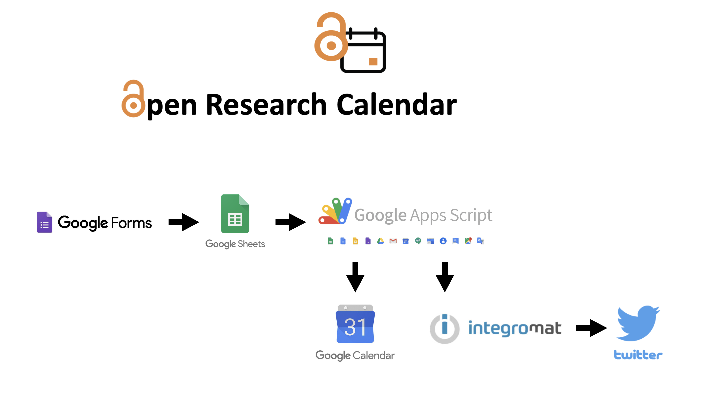

# Open Research Calendar

<!-- Note from mkdocs: "If both an index.md and a README.md are in the same directorfy, mkdocs will render the index file" and the README will still be rendered on github (https://www.mkdocs.org/user-guide/writing-your-docs/). Adding frontmatter to README breaks it." -->

Thank you for visiting the Open Research Calendar project repository.

**This is the GitHub README**

This page is a hub to give you some information about the tool, what you will find in this repository and how to contribute. Jump straight to one of the sections below, or scroll down to find out more.

* [What are we doing? (And why?)](#what-are-we-doing)
* [Who are we?](#who-are-we)
* [What do we need?](#what-do-we-need)
* [Get in touch](#contact-us)
* [Re-use and licensing](#re---use-and-licensing)

## What are we doing?

This tool was designed to facilitate communication and sharing of global open research events. It was built to help event organisers attract other interested parties to their events, and help individuals find events which they would like to join.

It exists as a community managed tool, where anyone is free to submit an event, and we rely on the community to report suspicious events to administrators for removal.

The tool incorporates freely available resources to receive event information via a goole form, publish it to a google calendar and tweet about it to followers of [@openresearchcal](https://twitter.com/OpenResearchCal).

Further details of the processes and code used to run this tool are available in the [Documents](./Documents) directory.

## Who are we?

We are a small team or researchers who met at [Advanced Methods in Reproducible Science 2020](https://www.bristol.ac.uk/psychology/research/ukrn/ukrnevents/repro2020/) and built on an idea which was submitted for a hackathon at the previous 2019 meeting. We continue to support and develop this community tool alongside our day jobs!

The developers and maintainers of this tool are (alphabetically):
- [Cassandra Gould van Praag](https://ox.ukrn.org/people/#CassandraGouldvanPraag)
- Bradley Kennedy
- Alexandra Lautarescu
- Esther Plomp

We have recently received support from the [UK Reproducibility Network (UKRN)](https://www.ukrn.org) to elevate the infrastructure, support development, and raise awareness of this resource within our community.  

## What do we need?

Feedback and contributions!

The tool was designed, developed and launched in under 5 days in January 2020. Since then we have been making minor tweaks to the workflow. We are hopeful that the boost from UKRN will enable us to refine our processes at both the user and administrator end!

We welcome feedback on any aspect of the tool via our [github issues](https://github.com/openresearchcalendar/Open-Research-Calendar/issues).

We are particularly interested in extending the tool to for global compatibility, including the management of timezones and incorporation of alternatives to google.

## Contact us

Contact us via a tweet or direct message on twitter [@OpenResearchCal](https://twitter.com/OpenResearchCal]).

Email us at [openresearchcalendar@gmail.com](mailto:openresearchcalendar@gmail.com).

Comment on this repository via [github issues](https://github.com/openresearchcalendar/Open-Research-Calendar/issues)

## Re-use and licensing

We'd love for you to re-use this tool for your own community! We are sharing our code and resources under the [GNU Public License](LICENSE.txt).

We are grateful for acknowledgement using the reference below:

To Do: Add zenodo integration - CGVP
